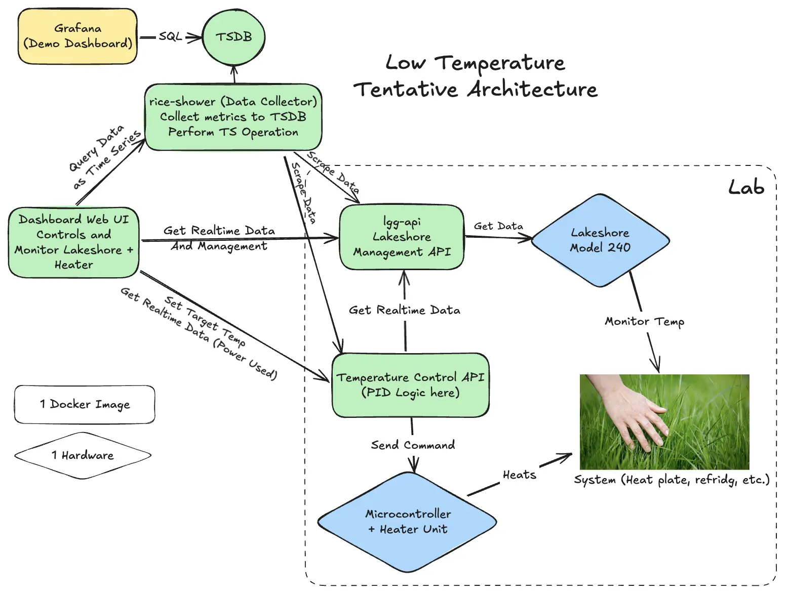

# Low Temperature Control

Capstone Project for Computer Engineering, Chulalongkorn University

## Folder Structure

### Apps

- `collector` (Rice Shower): Data Collector for Lingangu API and Temperature API. It also serves as a TSDB query server for the dashboard app. (Bun + Elysia)
- `heater-api` (Heater API): API Server that controls the Heater via GPIO with PID Logic (Python FastAPI app with RPi.GPIO)
- `ls-api` (Lingangu API): Lakeshore Management API (Python FastAPI app connecting USB Serial to Lakeshore Devices)
- `simulator` (Environment Simulator): Simulator for Foam Box, works as stub/mocks for lgg-api and heater-api (Bun + Elysia)
- `web` (Almond Eye): Dashboard Application (Next.js)

### Packages (Internal)

- `api-client`: API Client for each API services using `openapi-generator`
- `config`: ESLint and TypeScript configurations
- `tsdb`: Database Schema for TimescaleDB
- `main-db`: TODO
- `ui`: React UI Component Library powered by Shadcn UI

### .env

.env are located in the folder of each apps/packages, please refer to the `.env.example` files for the required environment variables of each app.

## Setup

This repository has two languages and three runtimes: TypeScript (Node.js and Bun) and Python.

### Node.js and pnpm (Package Manager)

Use node.js with the version specified in `.nvmrc` file (currently `lts/krypton` or 24 LTS). Running `node -v` should output v24.x.x.

Recommend using `nvm` (Node Version Manager) to manage Node.js versions. Install `nvm` from [nvm-sh/nvm](https://github.com/nvm-sh/nvm).

Run `corepack enable` to enable Corepack, then run `pnpm -v` to verify that the version of pnpm matches the version specified in `package.json`.

### Bun

Install Bun from [bun.com](https://bun.com).

Note that pnpm is still used as the package manager for Bun projects. You can run `pnpm dev` which will delegate to Bun.

### Python + UV

Install Python with version specified in `.python-version` file (currently `3.13`) and use `uv` (Universal Version Manager) to manage Python versions. Install `uv` from [astral-sh/uv](https://github.com/astral-sh/uv) and run `uv sync` to install the dependencies.

### Docker

Make sure you have Docker Desktop or Orbstack installed.

These are the container you will be running for local developments:

- timescaledb: TimescaleDB (A time-series database built on PostgreSQL)
- (Optional) grafana: Grafana (For testing SQL queries locally)

You can run these containers using `docker-compose.yaml` file provided in the root of this repository:

```bash
docker compose up -d
```

### Database Setup

Go to `packages/tsdb`, `.env` should already be setup for local development.

Then run `pnpm db:migrate` to setup the database schema.

## Architecture Diagram



### Running Locally

Use command `pnpm run dev` to run all services with mock devices that connects
to the simulator. `.env.dev` is already set and should not require any changes.

### Running in Lab Mode

Lab Mode is when you are using the real devices (Lakeshore 240 and Heater)

To run Lab Mode, make sure you filled in neccessary IPs in `.env.lab` files in each apps that requires it.

Then on laptop, run `pnpm run lab:laptop` and on Pi, run `pnpm run lab:pi` to start the services in Lab Mode.

To make uv work correctly on Raspberry Pi, you have to add `RPi.GPIO` to the `.venv`
by using command: (I forgot)

### URLs

- Lingangu API Swagger will be available at `http://localhost:8000/docs` or alternate scalar UI at `http://localhost:8000/scalar`
- Heater API Swagger will be available at `http://localhost:8001/docs` or alternate scalar UI at `http://localhost:8001/scalar`
- Rice Shower API Docs will be available at `http://localhost:8100/openapi`
- Simulator API Docs will be available at `http://localhost:8101/openapi`
- Almond Eye Dashboard will be available at `http://localhost:3100`

## Contribution

### OpenAPI and Codegen

When making changes to the API Server (Lingangu API, Temperature API, or Rice Shower), the swagger files located at `docs/**` of that project will be automatically generated upon server start.

However, you still have to run `pnpm codegen` in the root of the repository to regenerate the API Client packages used in other projects.

Please make sure to do this step before creating a pull request.
